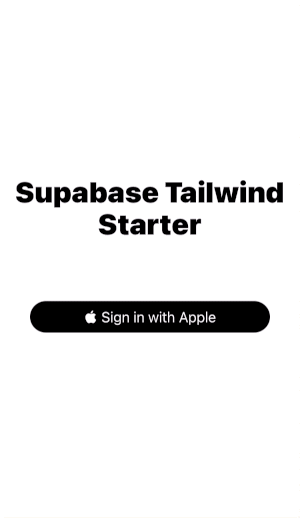

# supabase-tailwind-rn

A simple React Native Apple OAuth starter built with [Supabase](https://github.com/supabase/supabase) and [Tailwind RN](https://github.com/vadimdemedes/tailwind-rn/).

[How to use Supbase Apple OAuth in React Native](https://dev.to/dancurtis/how-to-use-supabase-apple-oauth-in-react-native-4c4h)

## Prerequisites

- Apple Developer Account
- Supabase Account
- Node v16
- Ruby

## Quick start

1. Clone the repo or use the template button
2. Install dependencies `npm install`
3. Set up Supabase and Apple OAuth https://supabase.com/docs/guides/auth/auth-apple
4. Rename `/lib/supabase-keys-example.js` to `/lib/supabase-keys.js` and add your keys from the Supabase dashboard in Settings > API. _Don't store keys like this in prod!_
5. Run `npm run tailwind:dev` in one terminal window
6. Run `npm run start` in another terminal window
7. Open the Expo app in Expo Go on a physical phone or with the Simulator

**Troubleshooting:**

- Ensure the Site URL in Supabase > Settings > Authentication is set to your Expo local URL. For example, `exp://192.168.0.158:19000`.
- Ensure the domain in Certificates, Identifiers & Profiles > Identifiers > Services IDs > Sign in with Apple > Configure is set to `supabase-project-id.supabase.co` without a leading https:// in the Service ID Identifier for Apple and the return URL is set to `https://supabase-project-id.supabase.co/auth/v1/callback`
- The tailwind class not found warning can safely be ignored

## Contributing

Pull requests are welcome if they improve upon the current code and do not add new features/dependencies.

## License

MIT
